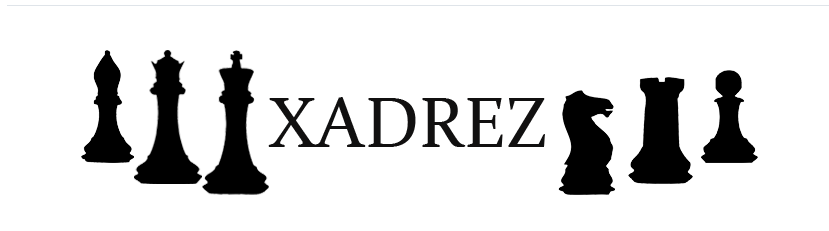

# Jogo de Xadrez

Este é um projeto de um jogo de xadrez desenvolvido utilizando C# e .NET. O objetivo é criar uma implementação funcional do jogo, permitindo que dois jogadores disputem uma partida com todas as regras oficiais do xadrez.

## Tecnologias Utilizadas

- C#
- .NET
- Programação Orientada a Objetos (POO)
- Console Application

## Funcionalidades

✅ Movimentação das peças conforme as regras do xadrez\
✅ Detecção de xeque e xeque-mate\
✅ Controle de turnos\
✅ Registro do histórico de jogadas\
✅ Validação de movimentos inválidos\
✅ Implementação de jogadas especiais como roque, en passant e promoção

## Como Executar

```sh
# Clone o repositório
git clone https://github.com/isabeletorres/JogoDeXadrez.git

# Navegue até o diretório do projeto
cd Xadrez

# Compile e execute o projeto
dotnet run
```

## Estrutura do Projeto

```sh

├── Xadrez/
│   ├── tabuleiro/
│   │   ├── Cor.cs
│   │   ├── Peca.cs
│   │   ├── Posicao.cs
│   │   ├── Tabuleiro.cs
│   │   ├── TabuleiroException.cs
│   ├── xadrez/
│   │   ├── Bispo.cs
│   │   ├── Cavalo.cs
│   │   ├── Dama.cs
│   │   ├── PartidaDeXadrez.cs
│   │   ├── Peao.cs
│   │   ├── PosicaoXadrez.cs
│   │   ├── Rei.cs
│   │   ├── Torre.cs
│   ├── Program.cs
│   ├── Tela.cs
│   ├── Xadrez.csproj
├── .gitignore
├── LICENSE
├── README.md
├── Xadrez.sln
```


